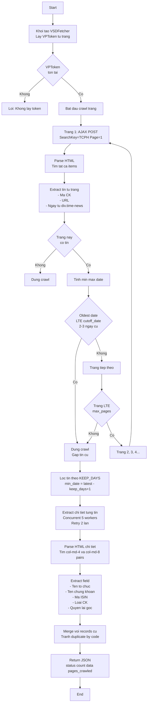
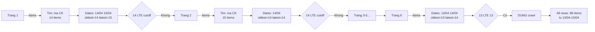
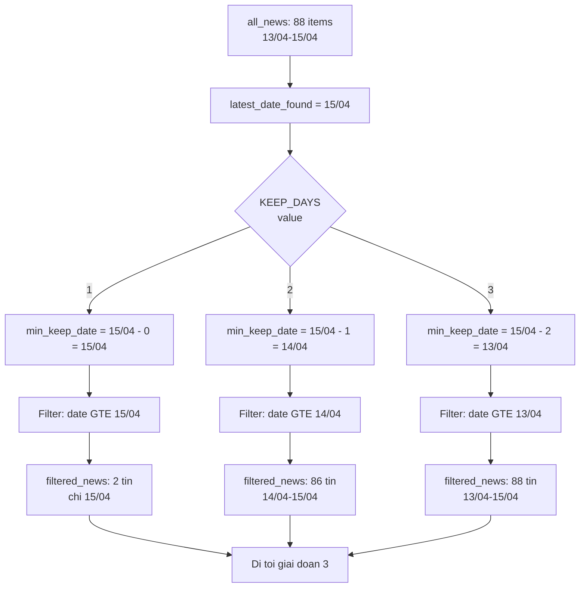
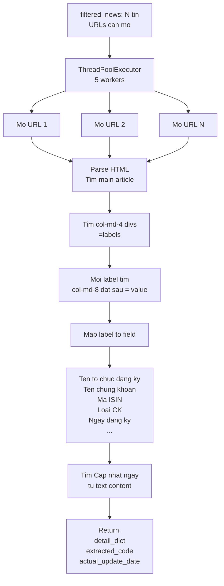
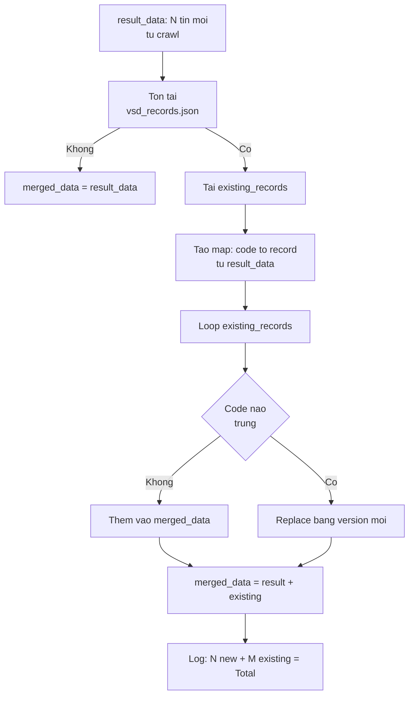

# Fetch VSD - Logic va Flow Chi Tiet (v1)

## Tong quan

Script `fetch_vsd.py` la mot web scraper tu dong de thu thap thong tin quyen chung khoan tu VSD (Vietnamese Securities Depository). No crawl trang tin tuc thi truong co so, extract chi tiet tung tin, va luu vao Excel.

## Cau hinh chinh

```python
KEEP_DAYS = 1  # So ngay gan nhat can lay (1, 2, 3, ...)
```

- **KEEP_DAYS=1**: Lay chi ngay moi nhat (2 tin tu 15/04)
- **KEEP_DAYS=2**: Lay 2 ngay gan nhat (86 tin tu 14/04-15/04)
- **KEEP_DAYS=3**: Lay 3 ngay gan nhat (88 tin tu 13/04-15/04)

---

## Luong xu ly chi tiet

### Flow Tong quan



---

## Chi tiet cac giai doan

### 1. Giai doan Crawl Listing

#### Muc dich
Crawl tung trang tin tuc de lay danh sach tin co ma chung khoan, dung khi gap tin cu hon 2 ngay.



**Logic dung crawl:**
- `cutoff_date = today - 2 days = 13/04`
- Khi tim thay `page_oldest_date LTE 13/04` --> **DUNG**
- Vi da cham moc 2 ngay tuoi

**Ket qua:** `all_news` = 88 tin tu cac trang 1-6

---

### 2. Giai doan Filter (Loc theo KEEP_DAYS)

#### Muc dich
Chi giu lai N ngay gan nhat tuy theo `KEEP_DAYS`



**Cong thuc loc:**
```python
min_keep_date = latest_date_found - timedelta(days=KEEP_DAYS - 1)
filtered_news = [n for n in all_news if n['date_obj'] >= min_keep_date]
```

**Vi du voi KEEP_DAYS=2:**
- `min_keep_date = 15/04 - (2-1) = 14/04`
- Giu tin co date >= 14/04
- Ket qua: 86 tin (loai bo 2 tin tu 13/04)

---

### 3. Giai doan Extract (Trich xuat chi tiet)

#### Muc dich
Mo tung URL tin tuc, parse HTML, va extract thong tin chi tiet



**Cau truc HTML muc tieu:**
```html
<div class="col-md-4">Ten to chuc dang ky:</div>
<div class="col-md-8">Cong ty ABC</div>

<div class="col-md-4">Ma ISIN:</div>
<div class="col-md-8">VN0ABC123456</div>
```

**Fallback (neu khong tim tu structure):**
- Dung regex tim tu text content
- Pattern: `"Ty le thuc hien[:\s]+(....)"`
- Ho tro multi-line va bullet points

**Concurrent Processing:**
```python
with ThreadPoolExecutor(max_workers=5) as executor:
    for idx, news in enumerate(filtered_news):
        future = executor.submit(extract_with_retry, news)
        if idx % 10 == 0:
            time.sleep(0.05)
```

---

### 4. Giai doan Merge (Hop nhat du lieu)

#### Muc dich
Hop nhat tin moi crawl voi tin cu, tranh duplicate



**Logic:**
```python
new_codes = {r['code']: r for r in result_data}

for existing_record in existing_records:
    if existing_record['code'] not in new_codes:
        merged_data.append(existing_record)
    else:
        # Replace voi version moi
```

---

## Du lieu dau ra

### JSON Structure
```json
{
  "status": "success",
  "date": "2026-04-15",
  "data": [
    {
      "code": "TV2",
      "title": "TV2: chuyen quyen so huu...",
      "url": "https://www.vsd.vn/vi/ad/194607",
      "date": "15/04/2026",
      "collected_date": "15/04/2026",
      "source": "VSD",
      "ten_to_chuc_dang_ky": "...",
      "ten_chung_khoan": "...",
      "ma_isin": "...",
      "noi_giao_dich": "...",
      "loai_chung_khoan": "...",
      "ngay_dang_ky_cuoi": "...",
      "ly_do_muc_dich": "...",
      "ty_le_thuc_hien": "...",
      "thoi_gian_thuc_hien": "...",
      "dia_diem_thuc_hien": "...",
      "quyen_nhan_lai": "Co",
      "quyen_tra_goc": null,
      "quyen_chuyen_doi": null
    }
  ],
  "count": 88,
  "pages_crawled": 5,
  "fetched_at": "2026-04-15T10:30:00.000000",
  "merge_info": "2 new records merged with 86 existing"
}
```

---

## Cơ che bao ve & Retry

### Token Management (VPToken)
- Lay tu `<meta name="__VPToken">` tren trang list
- Dung cho moi AJAX POST request phan trang
- Neu khong tim duoc -> Stop crawl

### Retry Logic
```python
max_retries = 3
for attempt in range(max_retries):
    response = session.get(url, timeout=10)
    if response.status_code == 200:
        break
    if attempt < max_retries - 1:
        time.sleep(0.2)
```

### Error Handling
- Loi HTTP -> Log warning, dung crawl trang do
- Loi parse -> Return (None, None, None) tu extract
- Loi merge -> Fallback: dung chi new data

---

## Performance

### Concurrent Request
- Listing crawl: Sequential (AJAX POST page by page)
- Detail extraction: Concurrent (ThreadPoolExecutor, 5 workers)
- Timing: 2-3 phut cho 80+ tin

### Memory
- Stream processing (khong load toan bo HTML vao RAM)
- JSON output co the to (2-3 MB cho 88 records)

---

## Tuy chinh de dang

| Tham so | Vi tri | Y nghia | Gia tri mac dinh |
|---|---|---|---|
| `KEEP_DAYS` | Dong 26 | So ngay can lay | `1` |
| `max_retries` | Line 107 425 | So lan thu lai | `3` `2` |
| `max_workers` | Line 465 | Thread pool size | `5` |
| `cutoff_date` | Line 264 | Dung khi cu hon N ngay | `today - 2 days` |
| `max_pages` | Line 256 | Toi da trang crawl | `25` |

---

## Checklist truoc khi dung

- [ ] Kiem tra `KEEP_DAYS` co gia tri mong muon (1, 2, 3...)
- [ ] VSD website van co cau truc HTML tuong tu
- [ ] Ket noi internet on dinh
- [ ] BeautifulSoup4, requests library da cai
- [ ] Output path `/app/vps-automation-vhck/data/` ton tai

---

## Tham khao

- **VSD URL:** https://www.vsd.vn/vi/tin-thi-truong-co-so
- **Pagination method:** AJAX POST (khong phai GET ?page=X)
- **Charset:** UTF-8
- **Date format:** DD/MM/YYYY tu VSD
