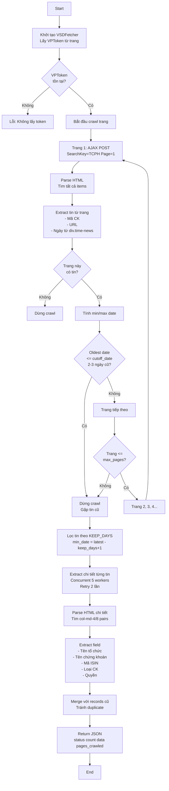
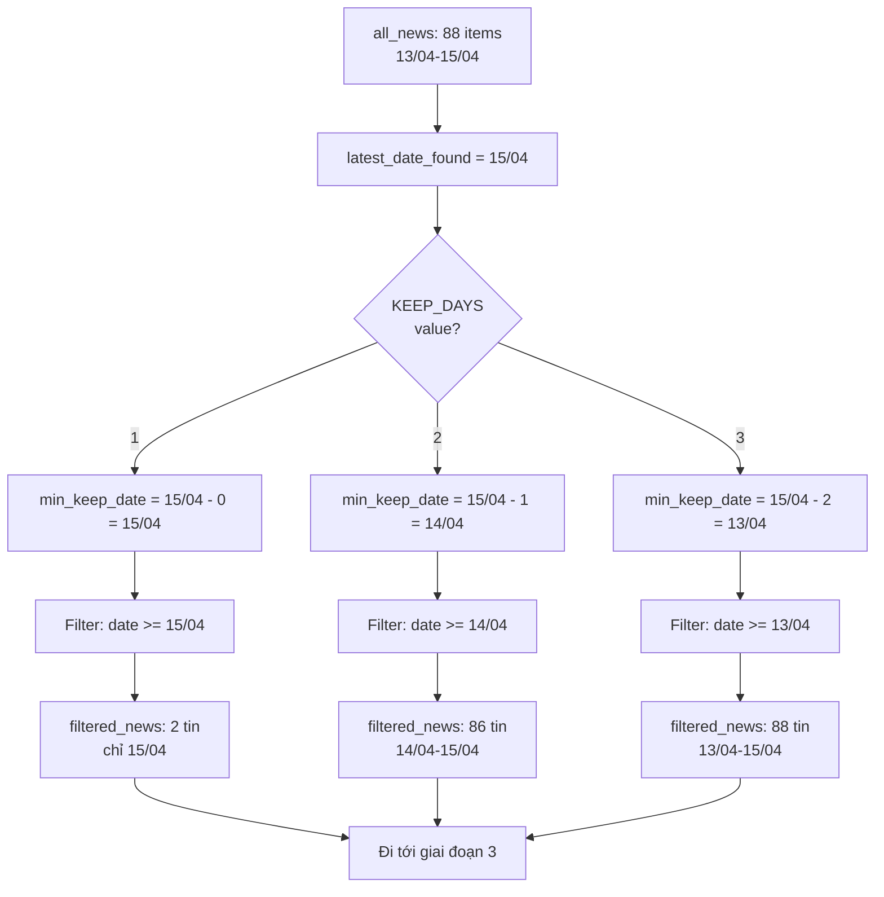
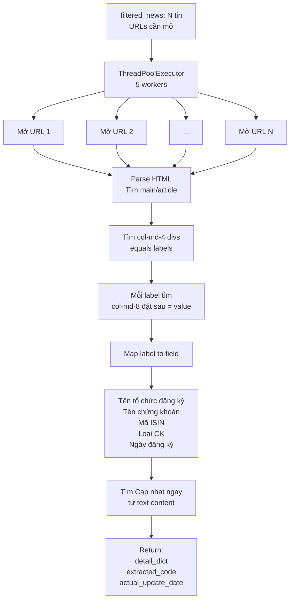
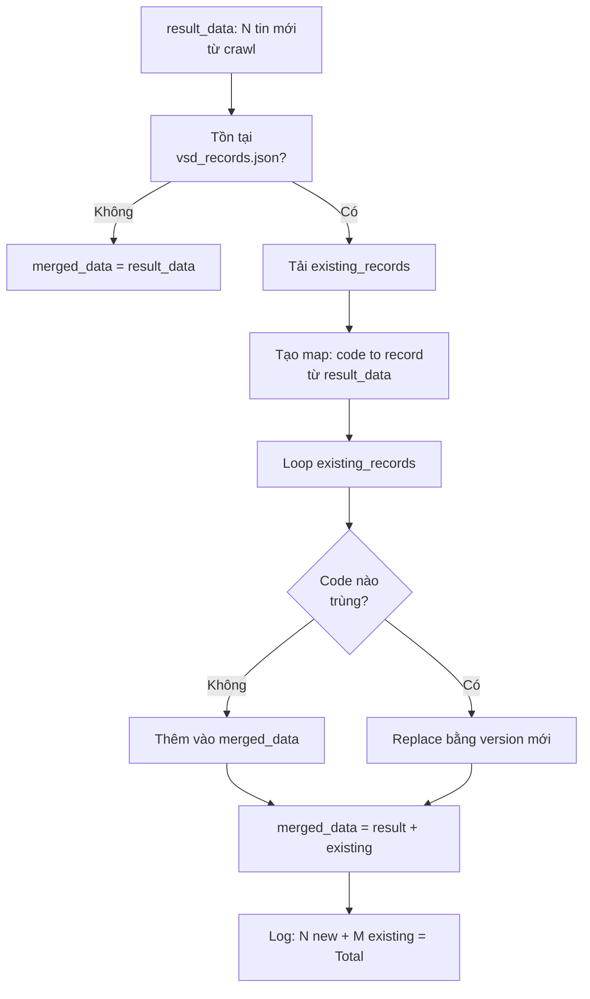

# Fetch VSD - Logic và Flow Chi Tiết (v1)

## 📋 Tổng quan

Script `fetch_vsd.py` là một web scraper tự động để thu thập thông tin quyền chứng khoán từ VSD (Vietnamese Securities Depository). Nó crawl trang tin tức thị trường cơ sở, extract chi tiết từng tin, và lưu vào Excel.

## 🔧 Cấu hình chính

```python
KEEP_DAYS = 1  # Số ngày gần nhất cần lấy (1, 2, 3, ...)
```

- **KEEP_DAYS=1**: Lấy chỉ ngày mới nhất (2 tin từ 15/04)
- **KEEP_DAYS=2**: Lấy 2 ngày gần nhất (86 tin từ 14/04-15/04)
- **KEEP_DAYS=3**: Lấy 3 ngày gần nhất (88 tin từ 13/04-15/04)

---

## 🔄 Luồng xử lý chi tiết

### Flow Tổng quan



---

## 📊 Chi tiết các giai đoạn

### 1️⃣ **Giai đoạn Crawl Listing (Thu thập danh sách tin)**

#### Mục đích
Crawl từng trang tin tức để lấy danh sách tin có mã chứng khoán, dừng khi gặp tin cũ hơn 2 ngày.

```mermaid
flowchart LR
    A["Trang 1"] -->|Items| B["Tìm: mã CK<br/>14 items"]
    B --> C["Dates: 14/04, 15/04<br/>oldest=14, latest=15"]
    C --> D{"14 <= cutoff?"}
    D -->|Không| E["Trang 2"]
    E -->|Items| F["Tìm: mã CK<br/>15 items"]
    F --> G["Dates: 14/04<br/>oldest=14, latest=14"]
    G --> H{"14 <= cutoff?"}
    H -->|Không| I["Trang 3-5..."]
    I --> J["Trang 6"]
    J -->|Items| K["Dates: 13/04, 14/04<br/>oldest=13, latest=14"]
    K --> L{"13 <= 13?"}
    L -->|Có| M["DỪNG crawl"]
    M --> N["All news: 88 items<br/>từ 13/04-15/04"]
```



**Logic dừng crawl:**
- `cutoff_date = today - 2 days = 13/04`
- Khi tìm thấy `page_oldest_date <= 13/04` → **DỪNG**
- Vì đã chạm mốc 2 ngày tuổi

**Kết quả:** `all_news` = 88 tin từ các trang 1-6

---

### 2️⃣ **Giai đoạn Filter (Lọc theo KEEP_DAYS)**

#### Mục đích
Chỉ giữ lại N ngày gần nhất tùy theo `KEEP_DAYS`



**Công thức lọc:**
```python
min_keep_date = latest_date_found - timedelta(days=KEEP_DAYS - 1)
filtered_news = [n for n in all_news if n['date_obj'] >= min_keep_date]
```

**Ví dụ với KEEP_DAYS=2:**
- `min_keep_date = 15/04 - (2-1) = 14/04`
- Giữ tin có date >= 14/04
- Kết quả: 86 tin (loại bỏ 2 tin từ 13/04)

---

### 3️⃣ **Giai đoạn Extract (Trích xuất chi tiết)**

#### Mục đích
Mở từng URL tin tức, parse HTML, và extract thông tin chi tiết



**Cấu trúc HTML mục tiêu:**
```html
<div class="col-md-4">Tên tổ chức đăng ký:</div>
<div class="col-md-8">Công ty ABC</div>

<div class="col-md-4">Mã ISIN:</div>
<div class="col-md-8">VN0ABC123456</div>
```

**Fallback (nếu không tìm từ structure):**
- Dùng regex tìm từ text content
- Pattern: `"Tỷ lệ thực hiện[:\s]+(....)"`
- Hỗ trợ multi-line và bullet points

**Concurrent Processing:**
```python
with ThreadPoolExecutor(max_workers=5) as executor:
    for idx, news in enumerate(filtered_news):
        future = executor.submit(extract_with_retry, news)
        if idx % 10 == 0:
            time.sleep(0.05)
```

---

### 4️⃣ **Giai đoạn Merge (Hợp nhất dữ liệu)**

#### Mục đích
Hợp nhất tin mới crawl với tin cũ, tránh duplicate



**Logic:**
```python
new_codes = {r['code']: r for r in result_data}

for existing_record in existing_records:
    if existing_record['code'] not in new_codes:
        merged_data.append(existing_record)
    else:
        # Replace với version mới
```

---

## 📝 Dữ liệu đầu ra

### JSON Structure
```json
{
  "status": "success",
  "date": "2026-04-15",
  "data": [
    {
      "code": "TV2",
      "title": "TV2: chuyển quyền sở hữu...",
      "url": "https://www.vsd.vn/vi/ad/194607",
      "date": "15/04/2026",
      "collected_date": "15/04/2026",
      "source": "VSD",
      "tên_tổ_chức_đăng_ký": "...",
      "tên_chứng_khoán": "...",
      "mã_isin": "...",
      "nơi_giao_dịch": "...",
      "loại_chứng_khoán": "...",
      "ngày_đăng_ký_cuối": "...",
      "lý_do_mục_đích": "...",
      "tỷ_lệ_thực_hiện": "...",
      "thời_gian_thực_hiện": "...",
      "địa_điểm_thực_hiện": "...",
      "quyền_nhận_lãi": "Có",
      "quyền_trả_gốc": null,
      "quyền_chuyển_đổi": null
    }
  ],
  "count": 88,
  "pages_crawled": 5,
  "fetched_at": "2026-04-15T10:30:00.000000",
  "merge_info": "2 new records merged with 86 existing"
}
```

---

## 🔐 Cơ chế bảo vệ & Retry

### Token Management (VPToken)
- Lấy từ `<meta name="__VPToken">` trên trang list
- Dùng cho mỗi AJAX POST request phân trang
- Nếu không tìm được → Stop crawl

### Retry Logic
```python
max_retries = 3
for attempt in range(max_retries):
    response = session.get(url, timeout=10)
    if response.status_code == 200:
        break
    if attempt < max_retries - 1:
        time.sleep(0.2)
```

### Error Handling
- Lỗi HTTP → Log warning, dừng crawl trang đó
- Lỗi parse → Return (None, None, None) từ extract
- Lỗi merge → Fallback: dùng chỉ new data

---

## 📈 Performance

### Concurrent Request
- **Listing crawl:** Sequential (AJAX POST page by page)
- **Detail extraction:** Concurrent (ThreadPoolExecutor, 5 workers)
- **Timing:** 2-3 phút cho 80+ tin

### Memory
- Stream processing (không load toàn bộ HTML vào RAM)
- JSON output có thể to (2-3 MB cho 88 records)

---

## 🎛️ Tùy chỉnh dễ dàng

| Tham số | Vị trí | Ý nghĩa | Giá trị mặc định |
|---|---|---|---|
| `KEEP_DAYS` | Dòng 26 | Số ngày cần lấy | `1` |
| `max_retries` | Line 107, 425 | Số lần thử lại | `3`, `2` |
| `max_workers` | Line 465 | Thread pool size | `5` |
| `cutoff_date` | Line 264 | Dừng khi cũ hơn N ngày | `today - 2 days` |
| `max_pages` | Line 256 | Tối đa trang crawl | `25` |

---

## ✅ Checklist trước khi dùng

- [ ] Kiểm tra `KEEP_DAYS` có giá trị mong muốn (1, 2, 3...)
- [ ] VSD website vẫn có cấu trúc HTML tương tự
- [ ] Kết nối internet ổn định
- [ ] BeautifulSoup4, requests library đã cài
- [ ] Output path `/app/vps-automation-vhck/data/` tồn tại

---

## 📚 Tham khảo

- **VSD URL:** https://www.vsd.vn/vi/tin-thi-truong-co-so
- **Pagination method:** AJAX POST (không phải GET ?page=X)
- **Charset:** UTF-8
- **Date format:** DD/MM/YYYY từ VSD
